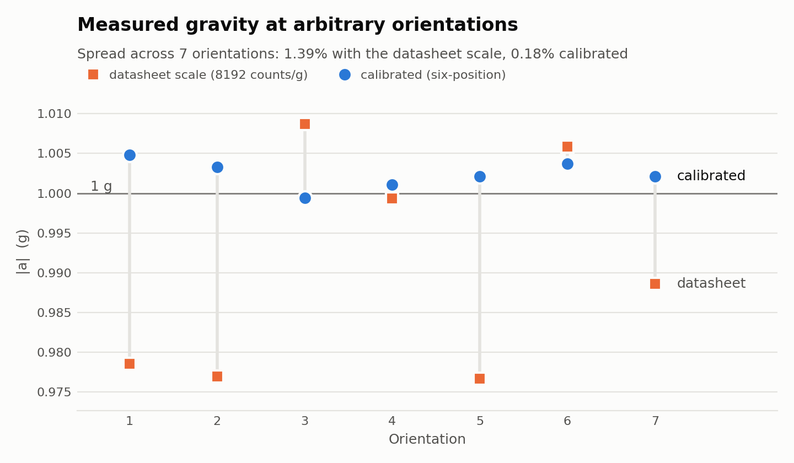

# accelerometer-calibration

Calibrating a low-cost MEMS accelerometer (MPU-9250/6500 series) against
references that do not depend on any other sensor.

- **Phase 1 — static (done).** Six-position calibration using gravity as the
  reference, checked independently at arbitrary tilts.
- **Phase 2 — dynamic (not started).** A Scotch-yoke shake table producing
  sinusoidal motion of known amplitude and frequency, to measure frequency
  response.

## Why

This project grew out of
[ccs-seismicity-screener](https://github.com/Quinn-777/ccs-seismicity-screener),
a screening framework for induced-seismicity risk at CO₂ storage sites. That
framework was checked against the monitoring records of three real projects,
but it took those records as given. Every one of them came from an instrument
with its own reference and its own error. This repository is an attempt to see,
hands-on, how a raw sensor reading becomes a number that can be trusted.

## Status

- [x] Sensor wired and communicating (I2C address 0x68)
- [x] Fit test printed and iterated
- [x] Calibration cube printed and inspected
- [x] Six-position static calibration
- [x] Independent check at arbitrary orientations
- [ ] Phase 2: shake table

## Phase 1: static calibration against gravity

### Method

At rest, an accelerometer reads 1 g along whichever direction points up. The
sensor is bolted inside a printed cube, and the cube is set on each of its six
faces in turn, so every sensor axis sees +1 g once and −1 g once. For each
axis, the midpoint of the two readings is the zero offset and half their
difference is the scale factor. No angle has to be measured; the method only
needs the cube's faces to be square.

The check is independent of the fit: gravity is 1 g in every orientation, so
after calibration √(ax² + ay² + az²) must come out at 1.000 g at any tilt,
including tilts that played no part in the calibration.

### Result



| Axis | Zero offset | Scale factor | vs datasheet (8192 counts/g) |
|---|---|---|---|
| X | −192 counts (−0.023 g) | 8182 counts/g | −0.12% |
| Y | +57 counts (+0.007 g) | 8217 counts/g | +0.31% |
| Z | +9 counts (+0.001 g) | 8054 counts/g | −1.69% |

Standard error about ±7 counts per value.

At seven orientations not used in the fit:

| | Datasheet scale | Calibrated |
|---|---|---|
| Spread in \|a\| | 1.39% | 0.18% |
| Worst case | 2.3% from 1 g | 0.48% from 1 g |

Only the Z axis departs noticeably from the datasheet value. Because each axis
has its own error, the uncalibrated error changes with orientation (from −2.3%
to +0.9%), so no single correction factor could remove it.

### Supporting checks

- **Out-of-sample readings.** Three Z-axis readings taken before the screws
  were re-tightened were left out of the fit. Their magnitude is 1.3–1.6% low
  with the datasheet scale and 1.001–1.004 g with the calibration.
- **Axis mapping.** Sensor +X points along cube −Y, +Y along cube −X, and +Z
  along cube −Z (the board is mounted chip-side down). Sensor X therefore runs
  along the board's short edge, which matches the silkscreen.
- **Mounting angles.** Each rotation of the board relative to the cube appears
  in two different position pairs, and the two estimates agree:

  | Rotation | Estimate 1 | Estimate 2 |
  |---|---|---|
  | About the line through the mounting holes | 3.10° | 3.32° |
  | In the board plane | 1.07° | 1.12° |
  | About the remaining axis | 0.33° | 0.48° |

  The tilt leaves the offsets unchanged and biases the X and Z scale factors low
  by 0.15–0.19%. That bias predicts calibrated magnitudes slightly above 1 g,
  which the arbitrary-orientation check then showed (mean 1.0024 g). A refit
  that forces |a| = 1 g at every calibration position removes it (mean 1.0013 g).

## Hardware

| Item | Detail |
|---|---|
| Sensor | MPU-9250/6500/9255 breakout, GY-9250 style, about 25 × 15 mm |
| Controller | Arduino Mega 2560 |
| Calibration cube | 50 mm PLA cube, printed on an Elegoo Neptune 3 Pro; sensor sits chip-side down in a 30 mm deep well |
| Fasteners | M2 × 10 screws; M2 nuts as 1.6 mm spacers under the board |

Wiring:

| Sensor | Mega 2560 |
|---|---|
| VCC | 5V |
| GND | GND |
| SCL | Pin 21 |
| SDA | Pin 20 |

Sensor settings: ±4 g range (AFS_SEL = 1, nominal 8192 counts/g), digital
low-pass filter 44 Hz.

## Reproducing the analysis

```
pip install -r requirements.txt
python analysis/six_position.py
```

The script holds all raw readings, prints the calibration and every check
above, and writes the figure to `docs/figures/magnitude_check.png`.

## Repository layout

```
analysis/six_position.py      calibration, cross-checks, validation, figure
docs/lab-notes.md             dated lab notes, newest first
docs/figures/                 generated figures
firmware/i2c_scan/            confirms the sensor answers at 0x68
firmware/read_raw/            streams raw counts on all three axes
hardware/fit_test.*           quick print to check the pocket and holes
hardware/calibration_cube.*   50 mm six-position calibration cube
```

## Known limitations

- Each reading is the mean of six consecutive serial-monitor lines, not a long
  average, so each value carries about ±7 counts of random error.
- Remounting repeatability is about 20–40 counts (0.003–0.005 g). This, not
  the arithmetic, limits offset accuracy.
- The board is tilted about 3.2° in its well because the edge with the pin
  header is unsupported. See the mounting angles above.
- Cube squareness was checked by measuring between opposite faces
  (49.68 mm on all three axes). That confirms size, not the angles between
  faces directly.
- Static range only: ±1 g. Linearity beyond 1 g and frequency response are
  not tested yet.
- The model is an offset and a scale factor per axis; cross-axis sensitivity
  is not modelled.
- Temperature was not recorded, and MEMS offsets drift with temperature.
- One sensor, one mounting.

## Phase 2 (planned)

A shake table driven by a stepper motor through a Scotch yoke, which turns
rotation into exactly sinusoidal motion. With the crank offset A measured by
calipers and the frequency f set by a hardware timer, the peak acceleration
A(2πf)² is known without any reference sensor. Note for the build: on this
board the sensor X axis runs along the short edge.

## Tools

Arduino IDE, OpenSCAD, ElegooSlicer, Python (NumPy, Matplotlib).

Claude (Anthropic) helped write the firmware, the OpenSCAD models and the
analysis script, and reviewed the method and results. Printing, assembly,
wiring and all measurements were done by the author.

## License

MIT
